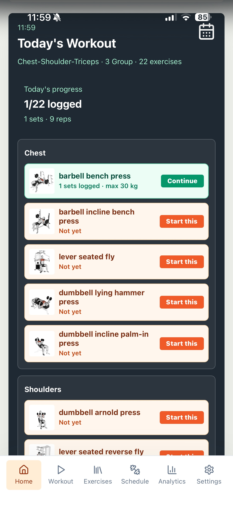
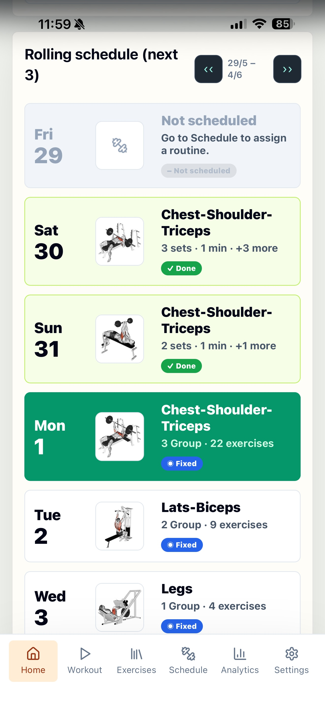
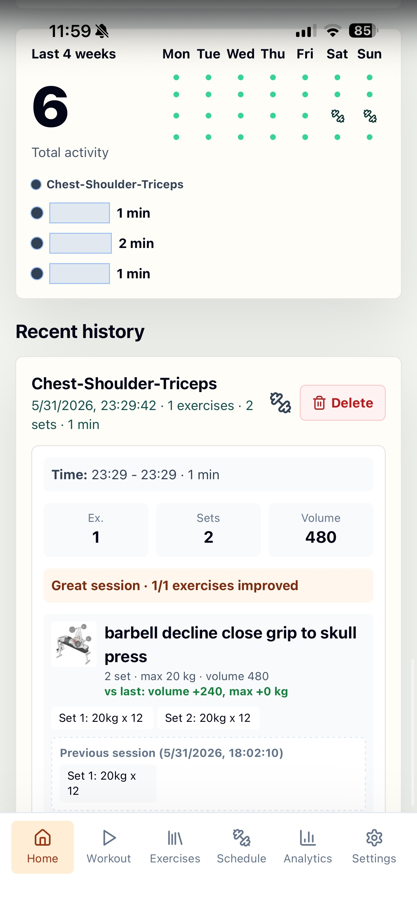
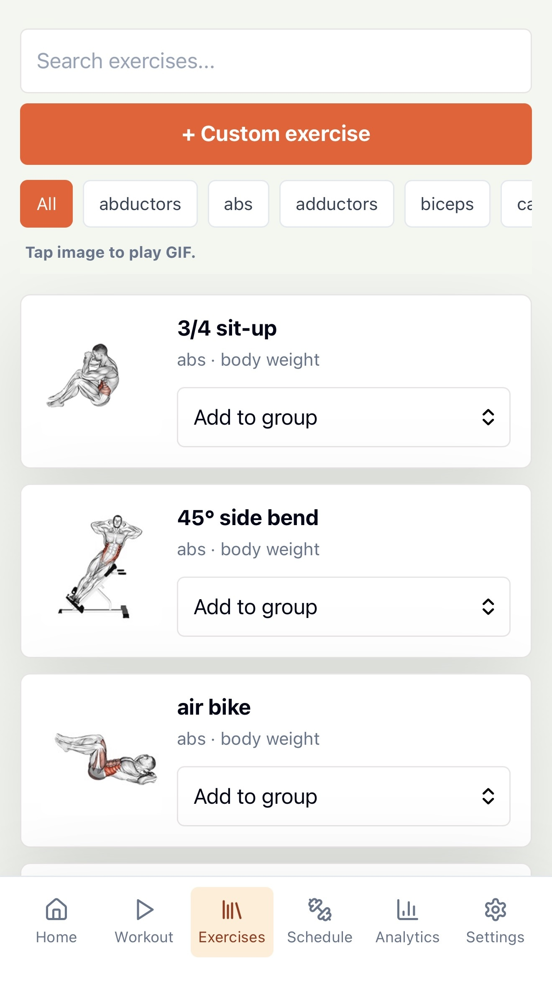
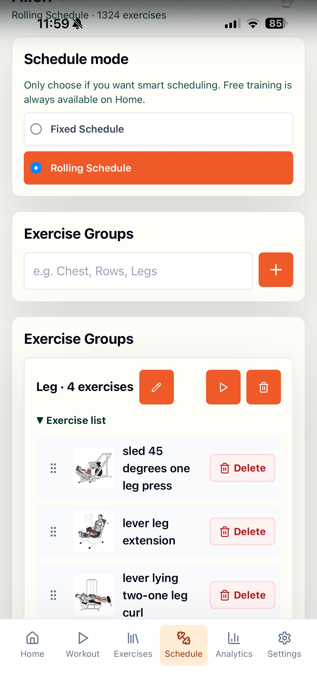
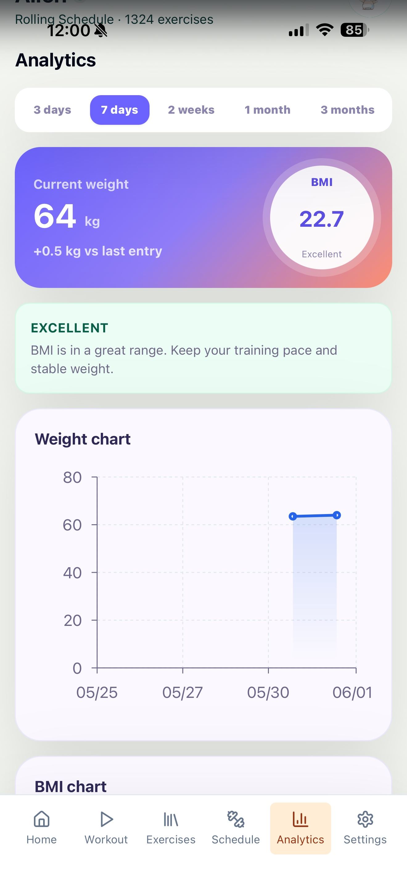
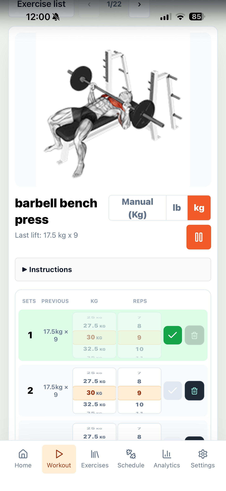

# Gym App

Gym App is a local-first workout tracker for personal or family use. It includes an exercise library with local JPG/GIF media, group/routine builders, workout logging, body-weight tracking, and basic analytics.

## Screenshots

<table>
  <tr>
    <td align="center"><br/><sub>Today's Workout</sub></td>
    <td align="center"><br/><sub>Weekly Schedule</sub></td>
    <td align="center"><br/><sub>Activity & History</sub></td>
    <td align="center"><br/><sub>Exercise Library</sub></td>
  </tr>
  <tr>
    <td align="center"><br/><sub>Schedule Builder</sub></td>
    <td align="center"><br/><sub>Analytics & BMI</sub></td>
    <td align="center"><br/><sub>Workout Logging</sub></td>
    <td></td>
  </tr>
</table>

## Local development

Prerequisites:

- Node.js 22+
- npm
- Internet access for the first dataset download

Clone the exercise dataset before the first local run:

```powershell
git clone --depth 1 https://github.com/hasaneyldrm/exercises-dataset.git hasaneyldrm-exercises-dataset
```

Then install dependencies and start the app:

```powershell
npm install
npm run dev
```

- Web: `http://localhost:5173`
- API: `http://localhost:3001`

Default login:

- Username: `admin`
- Password: `admin123`

Optional environment setup:

```powershell
Copy-Item .env.example .env
```

Edit `.env` before the first Docker run if you want to change `ADMIN_PASSWORD`, `PORT`, or `TZ`.

## Docker / Unraid

Prerequisites:

- Docker / Docker Compose
- Internet access during the first image build. The Dockerfile downloads the exercise dataset and bundles it into the image.

You do not need to download the exercise dataset manually for Docker/Unraid. The Dockerfile downloads and bundles it during image build.

Build and run from the repo folder:

```powershell
Copy-Item .env.example .env
docker compose up -d --build
```

Production URL:

- `http://SERVER_IP:3001`

Persistent data:

- SQLite database: `./data/gym.sqlite`
- Container path: `/app/data`

For Unraid, map an appdata folder to `/app/data`, for example:

```yaml
volumes:
  - /mnt/user/appdata/gym-app:/app/data
```

Recommended Unraid container settings:

| Setting | Value |
|---|---|
| Repository | `ghcr.io/thaihoang987/gym-app:latest` if you publish an image, or build from this repo with Docker Compose |
| WebUI | `http://[IP]:[PORT:3001]/` |
| Network | `bridge` |
| Web Port | Container `3001` to host `3001` |
| Appdata path | `/mnt/user/appdata/gym-app/data` mapped to `/app/data` |
| Restart policy | `unless-stopped` |
| Default username | `admin` |
| Default password | `admin123`, or the `ADMIN_PASSWORD` variable on a fresh database |

Files to back up:

- `/mnt/user/appdata/gym-app/data/gym.sqlite`
- `/mnt/user/appdata/gym-app/data/uploads`
- `/mnt/user/appdata/gym-app/data/exercise-translations` if you add custom translations

Server logs are written to:

- `/mnt/user/appdata/gym-app/data/logs/server.log`

This repo also includes `unraid-template.xml` for Community Applications/manual template use.

## Backup and restore

Gym App has two JSON backup modes:

| Mode | What it includes | Intended use |
|---|---|---|
| User backup | Current user's workout data, custom exercises, routines, body weight logs, exercise settings, and that user's uploaded images/GIFs/icons. It does not include passwords. | Move or restore one user's private training data. |
| Admin backup | Login records for all users, including encrypted `password_hash` values, plus admin-owned workout data and admin uploaded images/GIFs/icons only. It does not include other users' workout logs, body weights, notes, or uploads. | Restore accounts/login after migration while preserving user privacy. |

Password hashes are one-way encrypted values. They are not decrypted during restore; admin restore writes the hash back so users can keep logging in with their existing passwords. Non-admin users should export/import their own user backups for privacy.

For a full Unraid/server backup, also keep the appdata folder:

```text
/mnt/user/appdata/gym-app/data
```

## Docker image registry

This repo includes a GitHub Actions workflow that builds and pushes Docker images to GitHub Container Registry:

- Stable image: `ghcr.io/thaihoang987/gym-app:latest` from `main`
- Beta image: `ghcr.io/thaihoang987/gym-app:beta` from `beta/log-template-metrics`
- SHA tags: `ghcr.io/thaihoang987/gym-app:sha-<commit>`
- Release tags: `ghcr.io/thaihoang987/gym-app:0.3.47` when pushing Git tags like `v0.3.47`
- Workflow: `.github/workflows/docker.yml`

If the package is public, Unraid users can run the image directly with:

```text
ghcr.io/thaihoang987/gym-app:latest
```

For beta testing on Unraid, use:

```text
ghcr.io/thaihoang987/gym-app:beta
```

If the package is private, open the package page on GitHub and set visibility to public, or log in to GHCR from Unraid before pulling.

## Publish to Unraid Community Apps

This repo includes an Unraid Community Applications template:

- [`unraid-template.xml`](unraid-template.xml)

Publishing checklist:

1. Push to `main` and confirm the Docker workflow publishes `ghcr.io/thaihoang987/gym-app:latest`.
2. In GitHub Packages, set the GHCR package visibility to **Public**.
3. Test install on your own Unraid server with `/mnt/user/appdata/gym-app/data` mapped to `/app/data`.
4. Optional but recommended: create an Unraid forum support topic and update the `<Support>` link in `unraid-template.xml`.
5. Submit the repository at `https://ca.unraid.net/submit`.

Full checklist: [`docs/UNRAID_COMMUNITY_APPS.md`](docs/UNRAID_COMMUNITY_APPS.md).

## Update flow

This repo is structured so updates can be pulled and rebuilt without touching user data:

```powershell
git pull
docker compose up -d --build
```

The app keeps persistent workout data in `./data`, which is mounted into the container. Do not commit `data/*.sqlite*` to GitHub.

## Install on phone

Gym App includes PWA support, so it can be installed to the home screen on phones and tablets.

Android Chrome:

1. Open `http://SERVER_IP:3001`.
2. Open the browser menu.
3. Tap **Install app** or **Add to Home screen**.

iPhone / iPad Safari:

1. Open `http://SERVER_IP:3001`.
2. Tap the Share button.
3. Tap **Add to Home Screen**.

Notes:

- iOS and Android must be on the same network as the server unless you expose the app through a reverse proxy/VPN.
- Browser notification behavior is limited on iOS/Android and depends on browser permissions.
- PWA install works best over HTTPS. Local LAN HTTP can still be opened in the browser, but some PWA features may be limited.

## Included dataset

Gym App uses `hasaneyldrm/exercises-dataset` for the default exercise library:

- `hasaneyldrm-exercises-dataset/data/exercises.json`: 1,324 exercises
- `hasaneyldrm-exercises-dataset/images`: JPG thumbnails
- `hasaneyldrm-exercises-dataset/videos`: GIF animations

The dataset folder is not committed to this repo. For Docker builds, it is downloaded during image build. For local development, clone it manually with the command in the Local development section.

The library list renders lightweight JPG cards in batches. GIF files are loaded only when opening exercise detail or entering workout mode.

The bundled exercise dataset is for personal, educational, and non-commercial use according to the dataset README. Exercise images and GIFs may belong to their respective copyright holders. See [`THIRD_PARTY_NOTICES.md`](THIRD_PARTY_NOTICES.md) before redistributing this repo or Docker image publicly.

## Troubleshooting

### Docker build fails while downloading packages or dataset

The first build needs internet access for npm packages and `hasaneyldrm/exercises-dataset`. Check DNS/network access from the Docker host and run:

```powershell
docker compose build --no-cache
docker compose up -d
```

### Cannot open the app from a phone

Make sure the phone is on the same LAN/VPN as the server. Use:

```text
http://SERVER_IP:3001
```

If it still fails, check firewall rules and confirm the container maps host port `3001` to container port `3001`.

### Default password does not change

`ADMIN_PASSWORD` only applies when the database is created for the first time. If `data/gym.sqlite` already exists, change the password inside the app Settings or delete the database only if you intentionally want a fresh install.

### Library is empty in local development

For local `npm run dev`, clone the dataset manually:

```powershell
git clone --depth 1 https://github.com/hasaneyldrm/exercises-dataset.git hasaneyldrm-exercises-dataset
```

Docker builds download this dataset automatically.

### Uploaded images or GIFs are missing after update

Check that `/app/data` is mapped to persistent storage. Uploaded files live under:

```text
/app/data/uploads
```

On Unraid this should be:

```text
/mnt/user/appdata/gym-app/data/uploads
```

### Check server logs

Local/Docker Compose:

```powershell
Get-Content .\data\logs\server.log -Tail 50
docker logs gym-app
```

Unraid:

```bash
tail -f /mnt/user/appdata/gym-app/data/logs/server.log
```

### Connect / Disconnect indicator is red

The app checks `/api/health` every 10 seconds. Red means the browser cannot reach the backend. Check that the server/container is running and that the phone/browser is using the correct server IP and port.

## Third-party licenses

Gym App uses third-party open-source modules such as React, Vite, Express, dnd kit, react-wheel-picker, Recharts, lucide-react, Tailwind CSS, and others. See [`THIRD_PARTY_NOTICES.md`](THIRD_PARTY_NOTICES.md) for license and attribution details.

## Donate

Gym App is free for personal use. If it helps you, you can optionally support development and maintenance:

- Ko-fi: https://ko-fi.com/leonbell
- PayPal: https://paypal.me/leonbell95

Donations are voluntary and do not purchase a license to any third-party exercise dataset, images, or GIFs bundled with or referenced by this project.

## Notes

- Build output is generated into `dist`.
- `node_modules` and runtime database files are ignored for Docker/Git usage.
- The Dockerfile builds the frontend and serves the production app through the Express server on port `3001`.
